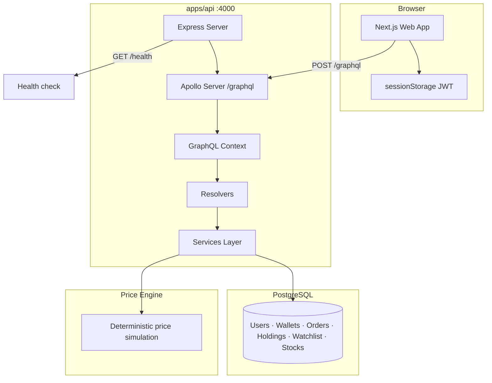

# Architecture

## High-Level System Diagram



---

## Request Lifecycle

A typical authenticated GraphQL request flows like this:

```
1. Browser (apps/web)
   └── lib/graphql/client.ts builds POST to /graphql
       └── Adds Authorization: Bearer <token> from sessionStorage

2. Express (apps/api/src/index.ts)
   └── CORS check (origin must match CORS_ORIGIN)
   └── express.json() parses body
   └── expressMiddleware passes request to Apollo

3. Context (apps/api/src/context.ts)
   └── Extracts Bearer token from Authorization header
   └── verifyToken() → userId (or marks hasInvalidToken)

4. Resolver (apps/api/src/graphql/resolvers/*)
   └── requireAuth(context) for protected operations
   └── Calls service functions

5. Service (apps/api/src/services/*)
   └── Business logic (orders, prices, portfolio math)
   └── Prisma queries inside transactions where needed

6. Response
   └── JSON { data } or { errors } back to client
```

---

## Monorepo Structure

### `apps/api` — Backend

| Path | Purpose |
|------|---------|
| `src/index.ts` | Server bootstrap, CORS, `/health`, `/graphql` |
| `src/context.ts` | Per-request GraphQL context (userId, prisma) |
| `src/graphql/schema.ts` | GraphQL type definitions (SDL string) |
| `src/graphql/resolvers/` | Query and mutation handlers |
| `src/graphql/errors.ts` | `badUserInput`, `unauthenticated` helpers |
| `src/lib/auth.ts` | bcrypt + JWT sign/verify |
| `src/lib/requireAuth.ts` | Guard for authenticated resolvers |
| `src/lib/prisma.ts` | Prisma client singleton |
| `src/services/` | Domain logic (orders, prices, portfolio) |
| `prisma/schema.prisma` | Database schema |
| `prisma/seed.ts` | Stock catalog + demo user |
| `prisma/migrations/` | Version-controlled SQL migrations |

### `apps/web` — Frontend

| Path | Purpose |
|------|---------|
| `app/` | Next.js App Router pages |
| `components/` | React UI (dashboard, stock, wallet, auth, layout) |
| `lib/graphql/` | Typed GraphQL client functions |
| `lib/auth/` | Auth context + sessionStorage token helpers |
| `lib/watchlist/` | Watchlist React context (API-backed) |
| `lib/hooks/` | Shared hooks (`usePolling`) |
| `lib/utils/` | Formatters (`formatCurrency`, etc.) |
| `lib/order/` | Client-side order validation |
| `lib/site/` | Metadata and resource hints |

### `packages/`

| Package | Purpose |
|---------|---------|
| `@stockfolio/config` | Shared ESLint, Prettier, TypeScript base config |
| `@stockfolio/ui` | Shared React components consumed by web |
| `@stockfolio/graphql-types` | Placeholder for future GraphQL Code Generator output |

---

## Layered Backend Design

The API follows a simple three-layer pattern:

```
GraphQL Resolvers  →  thin: parse args, auth check, map to GraphQL types
       ↓
Services           →  business logic: orders, pricing, portfolio calculations
       ↓
Prisma             →  database access
```

**Why this matters:** Resolvers stay small and testable. Complex logic (e.g. buy order with wallet debit + holding update) lives in `orderService.ts`, not in the resolver file.

---

## Frontend Architecture

```
Pages (app/*)
  └── Feature components (components/dashboard, stock, wallet)
        └── UI primitives (components/ui, @stockfolio/ui)
        └── lib/graphql/* (data fetching)
        └── React contexts (auth, watchlist)
```

**State management:** No Redux or Zustand. The app uses:

- **React Context** for auth and watchlist
- **Local component state** for forms, modals, and page data
- **useEffect + callbacks** for data loading
- **usePolling** for periodic quote refresh

**Auth is client-side only.** There is no Next.js middleware protecting routes. Pages check `isAuthenticated` and show sign-in prompts or empty states.

---

## Data Flow Examples

### Login

```
AuthModal → loginUser() → GraphQL mutation login
  → API validates password, returns JWT + user
  → storeAuth() writes to sessionStorage
  → AuthContext sets user state
  → WatchlistContext refetches watchlist from API
```

### Place buy order

```
OrderSection / StockTradePanel
  → Client validates cash balance
  → OrderConfirmModal shows confirmed price
  → placeOrder(ticker, BUY, qty, confirmedPrice)
  → API: assertConfirmedPrice (0.5% tolerance)
  → API: prisma.$transaction (debit wallet, update holding, create order + transaction)
  → OrderFeedbackModal shows fill details
  → Dashboard refreshKey increments → portfolio refetched
```

### Watchlist toggle

```
StockHeader Watch button
  → toggle(ticker) in WatchlistContext
  → addToWatchlist / removeFromWatchlist mutation
  → API updates WatchlistItem table
  → Context updates symbols array
  → WatchlistSection re-polls quotes for new list
```

---

## External Dependencies

| Dependency | Used for | Status |
|------------|----------|--------|
| PostgreSQL | Persistent data | Required |
| Finnhub / market API | Live quotes | Planned, not integrated |
| Dicebear API | Generated user avatars | Used by Avatar component |

---

## Security Boundaries

| Concern | Implementation |
|---------|----------------|
| Password storage | bcrypt hashes in `User.passwordHash` |
| API auth | JWT in `Authorization: Bearer` header |
| CORS | Restricted to `CORS_ORIGIN` (default `http://localhost:3000`) |
| Token storage | `sessionStorage` (tab-scoped, not `localStorage`) |
| Input validation | Email regex, min 8-char password, positive quantities |

See [Roadmap & Limitations](./12-roadmap-and-limitations.md) for known security gaps.

---

## Next Steps

- [Database](./04-database.md) — data models
- [GraphQL API](./05-graphql-api.md) — full API reference
- [Backend](./06-backend.md) — server implementation details
- [Frontend](./07-frontend.md) — web app structure
